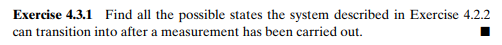
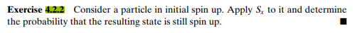
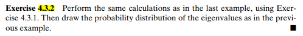
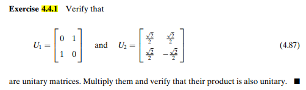
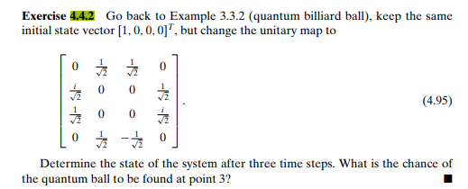
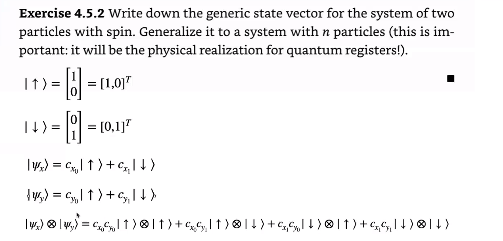
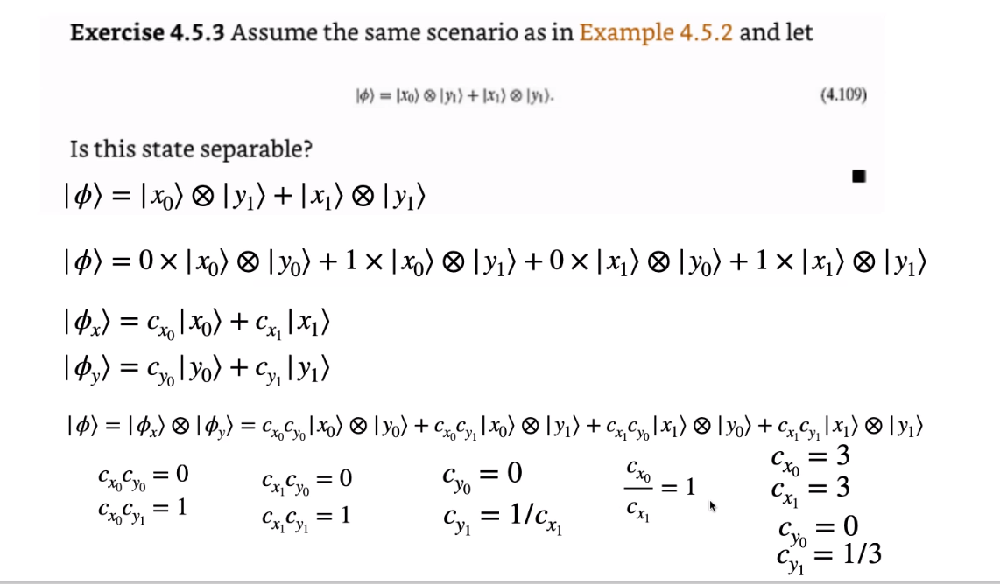

# Basic-Quantum-Theory

This library simulates different exercise, such as:
- 4.3.1.
- 4.3.2.
- 4.4.1.
- 4.4.2.

### 4.3.1.


### 4.3.2

### 4.4.1

### 4.4.2

### 4.5.2
For this exercise we need the generic or ground state of a particle with spin, i.e., up and down.
And two particles with initial states.

Representing the two particles with spin, X particle and Y particle. The combined system of the two particles is the tensor product of ψx and ψy.

These combinations are:

up with up

up with down

down with up

down with down

That is to say:

Cx0 * Cy0

Cx0 * Cy1

Cx1 * Cy0

Cx1 * Cy1

The vector space of the combination or tensor product depends on the state of the particles, in this case as the states are in C2 the vector space in which is the tensor product is C4.


### 4.5.3
According to the given vector, we must verify if it is separable, i.e., that it can be expressed as the tensor producer of two separate vectors.

If it is separable, the state of that particle X is the one shown in the image and the state of the particle is Y. If it is not separable it is not possible since we depend on what we get in a universe to see what gives us the state of the particle.

The first state of the image is the same as the second state of the image. Knowing that there are two particle systems in two positions (one particle at x=1 or x=1 and y=0 or y=1), to calculate the combined state of the two systems we have the second state in the image.

Given the two systems in X and Y. Since they are separable we calculate the state for both X and Y. For that we combine them and if these are separable it means that they can be calculated.

Therefore:
Cx0 * Cy0 has to give 0.
Cx0 * Cy1 must give 1
Cx1 * Cy0 must give 0
Cx1 * Cy1 must give 1

Given these equations must have solution to be separable, otherwise it cannot be written as the tensor product of two states.

Solution.

Cx0 cannot be 0, therefore, Cy0 is equal to 0.

If Cy0 is 0 then Cy1 is equal to 1/Cx1.

Then, Cx0/Cx1=1.

Given this, there are infinite values that satisfy the equations so the state is separable.

In the picture is an example solution for the equations.



## Getting Started

- You have to clone this library for using it in your PC.
- Then you have to move it to the folder you want.
- Cloning the library

You have to write this in your Git cmd (If you do not have Git on your computer you can install it [Here](https://git-scm.com/))
```git bash
https://github.com/CamiloBzt/Basic-Quantum-Theory.git
```

In this moment you will have the repository in your PC

## Prerequisites
- [Python](https://www.python.org/)
- Numpy library

## Built With

* [Python 3.8](https://python.org/) - Python


## Authors

* **Juan Camilo Bazurto Arias** - *Systems Engineering Student* - [Linkedin](https://www.linkedin.com/in/juan-camilo-b-b65379105/) - [GitHub](https://github.com/CamiloBzt)